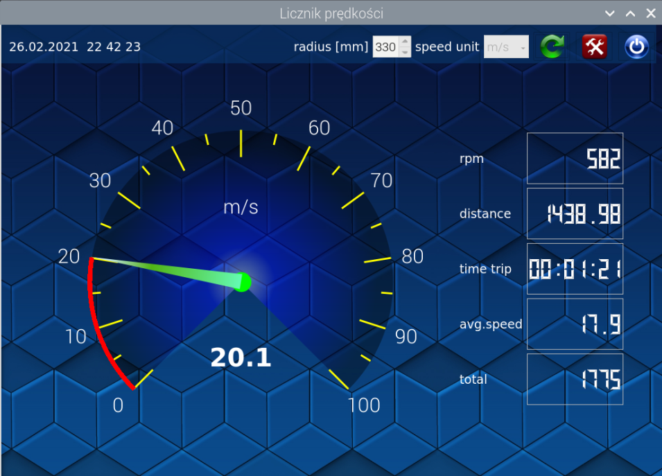

# Projekt licznika rowerowego  

**Na zaliczenie przedmiotu:** Programowanie z elementami systemów wbudowanych  

**Data:** 3.02.2021  
**Autor:** Piotr Wasilewski  

## Platforma  
- **Sprzęt:** Raspberry Pi 4 Model B  
- **Osprzęt:**  
  - Czujnik Halla A3144  
  - Diody LED  
  - Głośniczek  
  - Przycisk  

## Oprogramowanie  
- **System operacyjny:** Raspbian Linux  
- **Środowisko programistyczne:** Qt Creator  
- **Język programowania:** C++  

## Repozytorium i prezentacja  
- **GitHub:** [hall_sensor_gui](https://github.com/piotrw777/hall_sensor_gui.git)  
- **YouTube:** [Prezentacja projektu](https://youtu.be/9P1dUyM2dHk)  

## Opis  
Projekt licznika rowerowego, który oblicza:  
- Prędkość  
- Kadencję  
- Prędkość średnią  
- Czas jazdy  
- Dystans  
